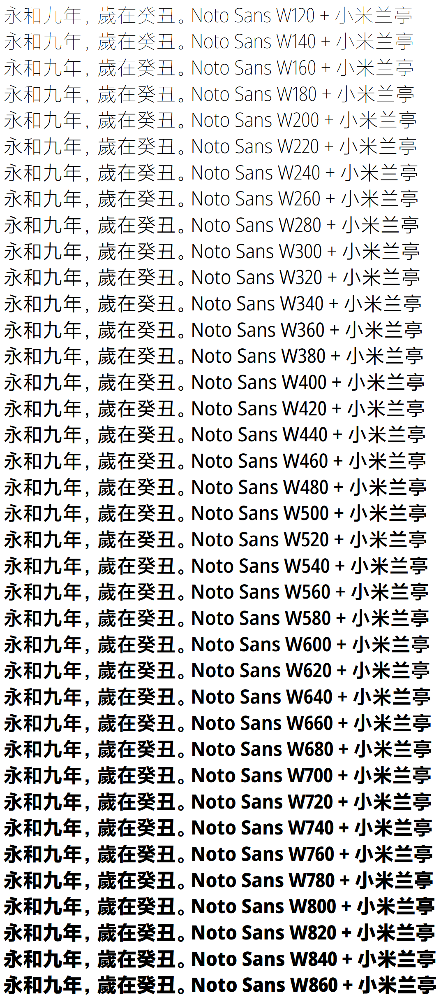

# Noto Milan — Nowar’s VF Experimentation

Build WoW Font Packs from OpenType Variable Font.

By merging [Noto Sans VF](https://github.com/googlefonts/noto-fonts/tree/master/phaseIII_only/unhinted/variable-ttf) and 小米兰亭 Pro VF, successor of [小米兰亭](http://www.miui.com/zt/miui8/index.html), Noto Milan has huge variety of weight.



## Choose Your Flavor

Noto Milan has many pre-defined weights and 3 regional variants.

### Weights

Noto Milan defined 745 weights: all integers from 116 (included) to 850 (included) are valid weights.

Non-integer weights can be built by customizing `configure.py # class Config # fontPackWeight`.
(See below # How To Build.)

### Regional Variants

GB and OSF are variants that supports a superset of Chinese national standard GB 18030-2000.

|     | European                             | 中文                             | 한국어 |
| --- | ------------------------------------ | -------------------------------- | ------ |
| GB  | Mainland China (UI)                  | Mainland China                   | N/A    |
| OSF | Mainland China (UI, Oldstyle Figure) | Mainland China (Oldstyle Figure) | N/A    |

RP is a special offer for Chinese RP realms. The RP distributions aim at unified experience for roleplaying players by mapping `丶` to the same glyph as `·`, allowing character names like “伊利丹丶怒风” to be shown as “伊利丹·怒风”.

|    | European                | 中文                | 한국어 |
| -- | ----------------------- | ------------------- | ------ |
| RP | Mainland China (UI, RP) | Mainland China (RP) | N/A    |

* European: English, Español (AL), Português, Deutsch, Español (EU), Français, Italiano, and Русский.
* UI: Ambiguous punctations are treated as Western.
* RP: `丶` (U+4E36) is mapped to the same glyph as `·` (U+00B7, MIDDLE DOT).

## How to Build

### Dependency

* Basic Unix utils,
* [Python](https://www.python.org/),
* [fonttools](https://github.com/fonttools/fonttools) or [afdko](https://github.com/adobe-type-tools/afdko),
* [otfcc](https://github.com/caryll/otfcc),
* [7-Zip](https://www.7-zip.org/) (add to `PATH`).

Note: choose 64-bit version if possible. 32-bit version may lead to out-of-memory issue.

### Get 小米兰亭 Pro VF (Mi Lan Pro VF)

小米兰亭 Pro VF is bundled in recent MIUI dev channel pre-11 releases.

With a Xiaomi phone, you can upgrade to such release, and simply run
```bash
adb pull /system/fonts/MiLanProVF.ttf
```

If you cannot do this, try [downloading MIUI OTA package](http://www.miui.com/download.html) and [extracting](https://forum.xda-developers.com/android/help/extract-dat-marshmallow-lollipop-easily-t3334117) `MiLanProVF.ttf` from it.

### Configure and Build

Run `configure.py` to generate Makefile. (Optional)
```bash
python configure.py
```

Put `MiLanProVF.ttf` to `milan/`, then `make` your flavor:
```bash
make NotoMilan-<region>-<weight>.7z -j<thread>
```
e.g.
```bash
make NotoMilan-OSF-450.7z -j6
```

## Note

* [Noto Sans VF](https://github.com/googlefonts/noto-fonts/tree/master/phaseIII_only/unhinted/variable-ttf) is the variable version of [Noto Sans](https://github.com/googlei18n/noto-fonts) by Google. It is still under development, and may receive major changes.
* 小米兰亭 Pro VF will be the next generation system-wide font in MIUI. It is produced by [方正字库](https://www.foundertype.com/) and published by Xiaomi.
* Noto Milan fonts, and WoW font packs, are for personal non-commercial use only. Do not distribute these font softwares.
